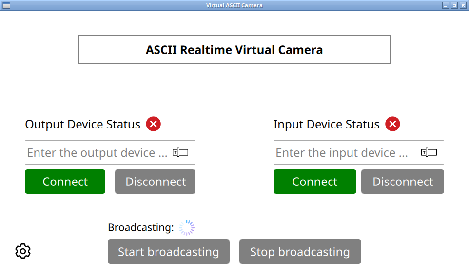
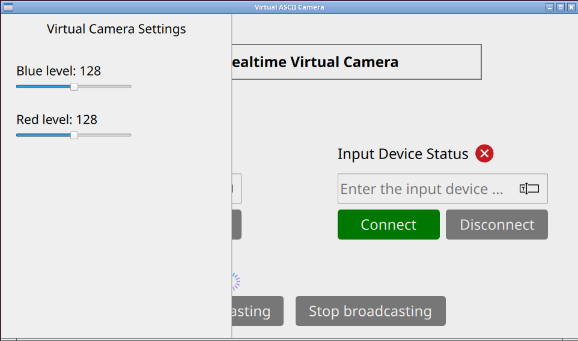
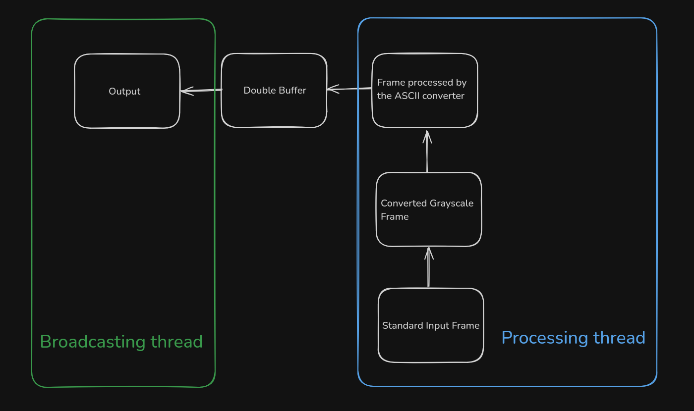

## Virtual ASCII Camera

## 📜 Description

This is a real-time ASCII converter that transforms the default input video into an ASCII-style output.
You can also adjust the blue and red levels in the output image in real-time.
The project provide a simple UI written in QML, using the Qt framework.

## 🖼 UI





## 🖇 How does it work (simple diagram) ?



## 📝 Technologies

- _CMake_
- _OpenCV_
- _Qt_
- _Qml_
- _C++_
- _v4l2loopback_

## 💻 Supported systems

- [ ] _Windows_
- [ ] _MacOS_
- [X] _Linux_

## ⚙️ Build

_Foreword:_
```
You must have:
- Qt 6.8.2
- v4l2loopback
```

_Cloning repository and dependencies_
```shell
git clone git@github.com:b1tflyyyy/virtual-ascii-camera.git
git submodule update --init --recursive
```

_Building OpenCV from sources_ 
OpenCV will be in third-party/opencv 
then use official guide to build it for your system [here](https://docs.opencv.org/4.x/d7/d9f/tutorial_linux_install.html) and add it to the `CMAKE_PREFIX_PATH`.

_Final build_
```shell
 cmake -G Ninja -DCMAKE_C_COMPILER=clang-19 -DCMAKE_CXX_COMPILER=clang++-19 -DCMAKE_BUILD_TYPE=Debug -DCMAKE_PREFIX_PATH=$OPENCV_INSTALL_DIR ..
 ninja 
```

## 🚀 Run 
_Creating a virtual device_
```shell
sudo modprobe v4l2loopback devices=1 video_nr=0 card_label="ASCIICam"
```

Then in UI set `Output Device` to `/dev/video0` and set `Input Device` to your input device. 
After that click on `Start Broadcasting` button.